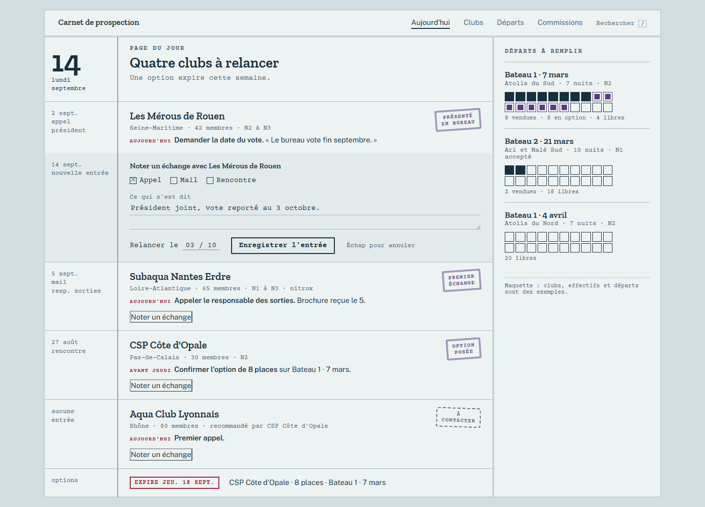
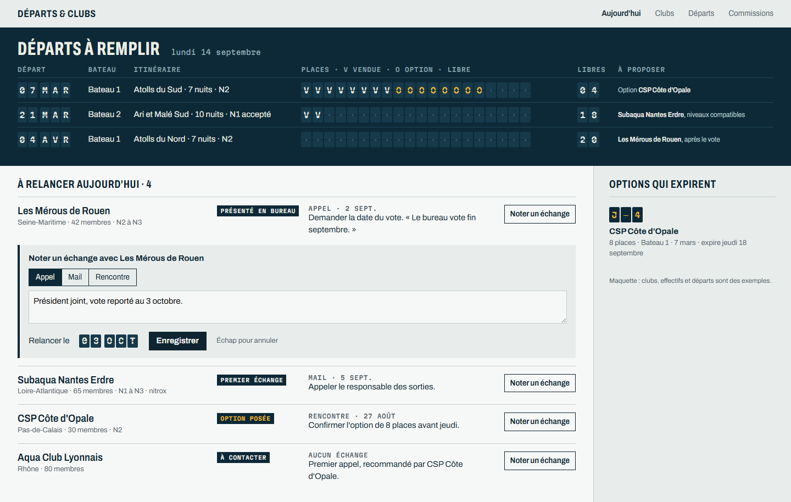
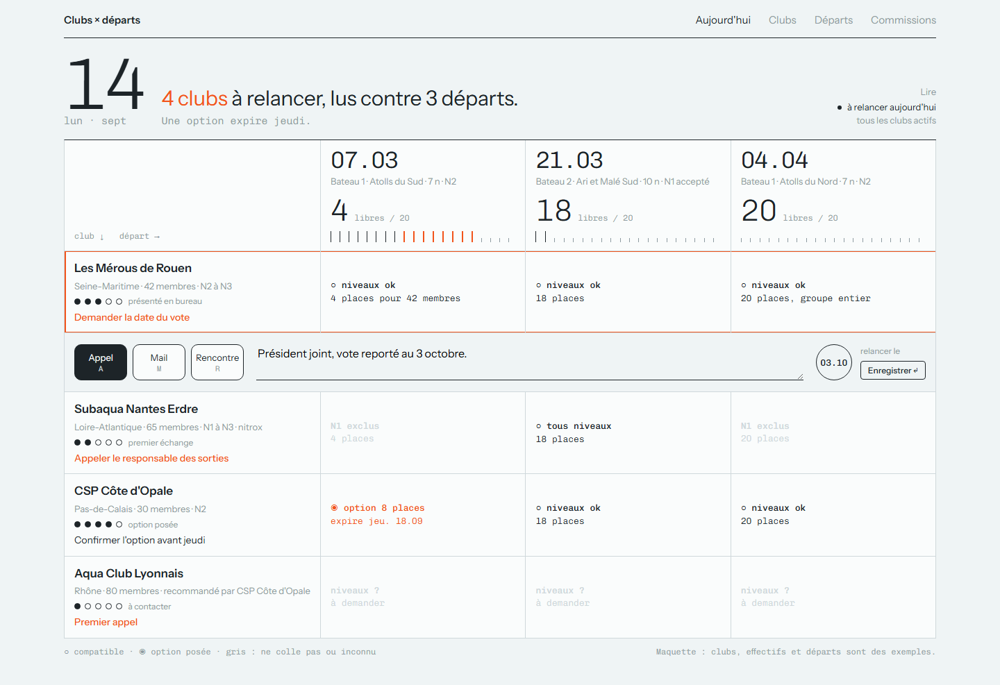
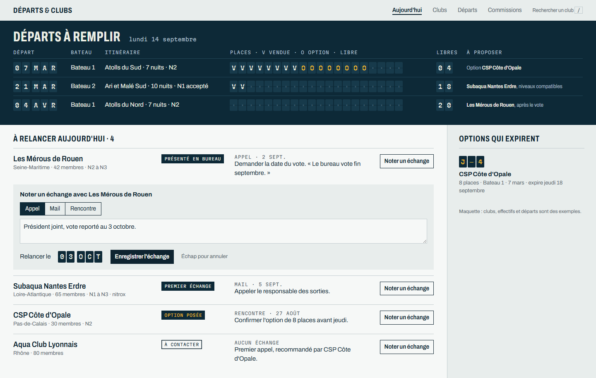

# Esquisse

**Concevoir l'UI/UX de n'importe quel site, application ou CRM sous Claude Code, sans
produire d'interface générée.**

---

## Le problème

Demandez une interface à un modèle, vous obtenez la moyenne de toutes les interfaces
qu'il a vues : Inter, un dégradé violet, trois cartes arrondies avec une icône, un
badge pilule au-dessus du titre, « Transformez votre… ». Ou, depuis que ces réflexes
sont connus, leurs remplaçants : fond crème et serif, fond noir et vert acide.

Le défaut n'est pas esthétique. **Rien n'a été décidé.** Et le code ne peut pas le
rattraper : quand l'écran est déjà construit, on ne fait plus que repeindre.

## Ce que fait Esquisse

Il impose l'ordre dans lequel un studio travaille, et il vérifie le résultat sur le
rendu réel.

| Commande | Ce qu'elle produit |
|---|---|
| `/esquisse:cadrage` | Le métier, les utilisateurs et leurs tâches par fréquence, **le vocabulaire du métier** |
| `/esquisse:ux` | Les parcours, l'inventaire des écrans et leurs quatre états, des **wireframes en gris** |
| `/esquisse:references` | Cinq références uniques, dont deux hors écran, avec pour chacune **l'idée précise à voler** |
| `/esquisse:directions` | **Trois directions distinctes, rendues sur le même écran**, pour choisir sur une image |
| `/esquisse:maquettes` | Tous les écrans et leurs états dans la direction choisie, critiqués sur capture |
| `/esquisse:passation` | Le contrat de construction pour le code : tokens, composants, signature |

## Trois idées qui le distinguent

**1. L'UX avant la couleur.** Les wireframes sont en niveaux de gris, et le check le
vérifie. Un écran qui ne se lit pas en gris ne sera pas sauvé par une palette.

**2. S'inspirer, mais juste.** Le générique naît du vide : sans référence, un modèle
dessine sa moyenne. Esquisse exige cinq références de trois familles (le monde du
client hors écran, des interfaces singulières, un pas de côté), en retient la
structure et l'idée, **jamais la palette**, et refuse comme source principale les
produits copiés au point d'être devenus eux-mêmes des clichés.

**3. Des directions rendues, pas décrites.** Trois directions qui diffèrent sur au
moins trois axes parmi palette, typographie, structure et signature. Changer les
couleurs d'une même mise en page n'est pas une direction, c'est du theming.

## Le check anti-slop

```
node scripts/check-slop.mjs <dossier | fichier.html | url> [--wireframe] [--mobile] [--captures dossier]
```

Il ouvre chaque écran dans un vrai navigateur et mesure **le rendu**, pas le code
source : face dominante, fond et accents calculés, dégradés, flou, distribution des
rayons, ombres, alignement, badge pilule au-dessus du titre, rangées de trois
colonnes icône-titre-phrase, formules creuses, faux contenu, débordement sur téléphone.
Quinze marqueurs, détaillés dans [docs/ANTI-SLOP.md](docs/ANTI-SLOP.md).

Aucun n'est interdit dans l'absolu : un parti pris écrit dans `esquisse/direction.md`
lève le marqueur correspondant. **Les marqueurs signalent une absence de décision,
pas une faute de goût.**

Une vérification impossible (navigateur absent) sort en code 2, jamais en succès.

**Ce qu'il ne voit pas, et il le dit à chaque exécution :** l'absence d'idée. Deux
contrôles restent humains et obligatoires. Le **test de substitution** : si l'écran
tient encore avec le nom d'un concurrent, il est générique. Et **le miroir** : sur la
capture, retirer un accessoire.

## Le hook

Dans un projet qui contient un dossier `esquisse/`, toute écriture de code applicatif
est **refusée** tant que `esquisse/validation.md` ne porte pas la ligne
`maquettes: validées`. Le travail de conception dans `esquisse/` reste libre. Les
projets sans dossier `esquisse/` ne sont jamais touchés.

## L'exemple : un CRM de prospection de clubs de plongée

Dans [examples/crm-plongee](examples/crm-plongee/esquisse). Un agent commercial vend les
places de deux bateaux de croisière plongée en démarchant des clubs. Le parcours
complet a été joué, avec un vrai choix entre les directions.

**La décision UX qui compte :** pas de tableau de bord. La question du matin est
« qui dois-je appeler, et quoi lui proposer », pas « combien ».

**Les trois directions, sur l'écran Aujourd'hui :**

| A · Carnet de plongée | B · Tableau des départs | C · Lecture croisée |
|---|---|---|
|  |  |  |
| Chaque échange est une entrée de carnet, les étapes sont des tampons | Chaque place est un volet de panneau de gare : vendue, en option, libre | Chaque club est lu contre chaque départ, comme une table de plongée |

**Direction retenue : B.** Maquette finale :



Les clubs, effectifs et départs de l'exemple sont inventés pour être plausibles, et
signalés comme tels sur chaque écran.

**Ce que l'exemple a appris à l'outil.** Le premier passage du check a pris un blanc
froid pour le cliché du crème, et un orange fluo pour de la terre cuite : la règle
exige désormais un fond chaud et un orange rompu. La critique sur capture a trouvé
deux défauts qu'aucun marqueur ne voyait : sur téléphone, les places du panneau
sortaient de l'écran, et l'action principale de la fiche tombait sous la ligne de
flottaison. La commande `/esquisse:maquettes` exige depuis la relecture des captures
téléphone, et le check mesure en plus le débordement de page à 390 px. Il ne
remplace pas cette relecture : aucun des deux défauts n'était un débordement de page.

## Installation

```
/plugin marketplace add Bowerlord/esquisse
/plugin install esquisse@esquisse-marketplace
npm run browser:install
```

Esquisse déclare le plugin officiel `frontend-design` en dépendance : il génère,
Esquisse décide de l'ordre, apporte les références et vérifie.

## Tests

```
npm test
```

## État

Version 0.1. Éprouvé sur un projet, de type CRM. Les types vitrine et SaaS sont décrits
dans [docs/UX.md](docs/UX.md) mais pas encore joués de bout en bout.

## Licence

MIT
